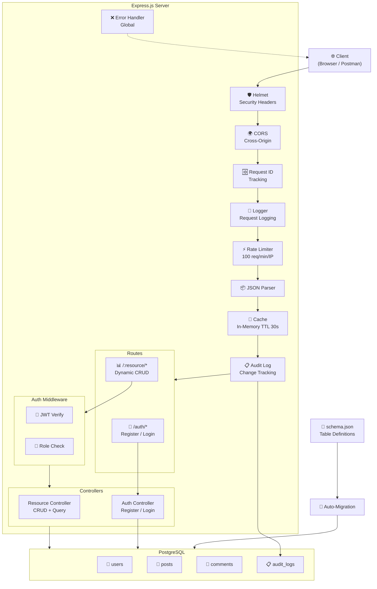

# 🚀 Smart API Hub

> REST API Platform tự động sinh API từ file `schema.json` — Node.js + TypeScript + Express + PostgreSQL

---

## 📖 Mục Lục

- [Kiến trúc](#-kiến-trúc)
- [Tính năng](#-tính-năng)
- [Cài đặt & Chạy](#-cài-đặt--chạy)
- [API Endpoints](#-api-endpoints)
- [Query Parameters](#-query-parameters)
- [Authentication](#-authentication)
- [Testing](#-testing)
- [Docker](#-docker)

---

## 🏗 Kiến trúc



---

## ✨ Tính Năng

| Tính năng | Mô tả |
|:---|:---|
| 🔄 **Auto-Migration** | Tự tạo bảng từ `schema.json` |
| 📊 **Dynamic CRUD** | GET, POST, PUT, PATCH, DELETE cho mọi resource |
| 🔍 **Advanced Query** | Pagination, Sorting, Filtering, Search |
| 🔗 **Relationships** | `_expand` (parent), `_embed` (children), nested routes |
| 🔐 **JWT Auth** | Register, Login, role-based access control |
| ⚡ **Rate Limiting** | 100 req/min/IP (tự viết, không thư viện) |
| 💾 **Response Cache** | In-memory TTL 30s, auto-invalidate |
| 📋 **Audit Log** | Ghi lại mọi thay đổi dữ liệu (async) |
| 🛡 **Security** | Helmet headers, CORS, Zod validation |
| 📖 **Swagger UI** | API docs tại `/api-docs` |

---

## 🚀 Cài Đặt & Chạy

### Yêu cầu
- Node.js ≥ 20
- PostgreSQL ≥ 15
- npm hoặc yarn

### 1. Clone & Install

```bash
git clone <repo-url>
cd smart-api-hub
npm install
```

### 2. Cấu hình `.env`

```env
DB_HOST=localhost
DB_PORT=5432
DB_NAME=pg_json_server
DB_USER=postgres
DB_PASSWORD=postgres
PORT=3000
JWT_SECRET=your-secret-key
JWT_EXPIRES_IN=24h
```

### 3. Tạo database PostgreSQL

```bash
createdb pg_json_server
```

### 4. Chạy Development

```bash
npm run dev
```

Server khởi động tại `http://localhost:3000`

### 5. Chạy bằng Docker (recommended)

```bash
docker-compose up --build
```

---

## 📊 API Endpoints

### System
| Method | URL | Mô tả |
|:---|:---|:---|
| GET | `/` | Thông tin server |
| GET | `/health` | Health check + DB ping |
| GET | `/api-docs` | Swagger UI |

### Authentication
| Method | URL | Auth | Mô tả |
|:---|:---|:---|:---|
| POST | `/auth/register` | - | Đăng ký (email, password, name) |
| POST | `/auth/login` | - | Đăng nhập → JWT token |

### Dynamic CRUD
| Method | URL | Auth | Mô tả |
|:---|:---|:---|:---|
| GET | `/:resource` | - | Lấy tất cả + query |
| GET | `/:resource/:id` | - | Lấy 1 record |
| GET | `/:resource/:id/:child` | - | Nested children |
| POST | `/:resource` | Token | Tạo mới |
| PUT | `/:resource/:id` | Token | Cập nhật toàn bộ |
| PATCH | `/:resource/:id` | Token | Cập nhật 1 phần |
| DELETE | `/:resource/:id` | Admin | Xóa (chỉ admin) |

---

## 🔍 Query Parameters

```bash
# Pagination
GET /posts?_page=1&_limit=10

# Sorting (multi-sort)
GET /posts?_sort=views&_order=desc
GET /posts?_sort=author,views&_order=asc,desc

# Filtering (exact match)
GET /posts?author=Nguyen+Van+A

# Operators
GET /posts?views_gte=100          # >= 100
GET /posts?views_lte=300          # <= 300
GET /posts?title_like=node        # ILIKE '%node%'
GET /posts?views_ne=0             # != 0

# Full-text search
GET /posts?q=typescript

# Select fields
GET /posts?_fields=id,title

# Expand (embed parent)
GET /comments?_expand=post

# Embed (embed children)
GET /posts?_embed=comments

# Nested route
GET /posts/1/comments
```

---

## 🔐 Authentication

### Register
```bash
curl -X POST http://localhost:3000/auth/register \
  -H "Content-Type: application/json" \
  -d '{"email":"user@example.com","password":"123456","name":"User"}'
```

### Login
```bash
curl -X POST http://localhost:3000/auth/login \
  -H "Content-Type: application/json" \
  -d '{"email":"user@example.com","password":"123456"}'
```

### Sử dụng Token
```bash
curl -X POST http://localhost:3000/posts \
  -H "Authorization: Bearer <your-token>" \
  -H "Content-Type: application/json" \
  -d '{"title":"New Post","content":"Hello","author":"User","views":0,"userId":1}'
```

### Phân quyền
- **GET** → Public (không cần token)
- **POST / PUT / PATCH** → Cần JWT token (user hoặc admin)
- **DELETE** → Chỉ admin

---

## 🧪 Testing

```bash
# Chạy tests
npm test

# Chạy tests (watch mode)
npm run test:watch
```

Test suite gồm **20 test cases** cover:
- ✅ Health check
- ✅ Register (success, duplicate email, missing fields)
- ✅ Login (success, wrong password)
- ✅ CRUD (get all, get by ID, create, 404, 401, 403)
- ✅ Advanced query (pagination, sorting, filtering, operators)
- ✅ Relationships (_expand, _embed, nested routes)

---

## 🐳 Docker

```bash
# Build & run
docker-compose up --build

# Run in background
docker-compose up -d

# Stop
docker-compose down

# View logs
docker-compose logs -f app
```

---

## 📁 Cấu trúc thư mục

```
smart-api-hub/
├── schema.json                    ← Định nghĩa bảng + seed data
├── .env                           ← Biến môi trường
├── docker-compose.yml             ← Docker setup
├── Dockerfile                     ← Multi-stage build
├── vitest.config.ts               ← Test config
├── package.json
├── tsconfig.json
├── src/
│   ├── index.ts                   ← Entry point + middleware stack
│   ├── swagger.ts                 ← Swagger UI setup
│   ├── controllers/
│   │   ├── auth.controller.ts     ← Register / Login
│   │   └── resource.controller.ts ← CRUD + query + relationships
│   ├── db/
│   │   ├── knex.ts                ← PostgreSQL connection
│   │   └── migrate.ts             ← Auto-migration from schema.json
│   ├── errors/
│   │   └── AppError.ts            ← Custom error classes
│   ├── middleware/
│   │   ├── auth.middleware.ts     ← JWT + role-based auth
│   │   ├── auditLog.middleware.ts ← [Bonus C] Audit logging
│   │   ├── cache.middleware.ts    ← [Bonus B] Response caching
│   │   ├── cors.middleware.ts     ← CORS configuration
│   │   ├── errorHandler.middleware.ts ← Global error handler
│   │   ├── logger.middleware.ts   ← Request logging
│   │   ├── rateLimiter.middleware.ts ← [Bonus A] Self-written rate limiter
│   │   ├── requestId.middleware.ts ← Request ID tracking
│   │   └── security.middleware.ts ← Helmet security headers
│   ├── routes/
│   │   ├── auth.route.ts          ← /auth/* routes
│   │   └── resource.route.ts      ← Dynamic /:resource/* routes
│   ├── types/
│   │   └── index.ts               ← TypeScript interfaces
│   └── utils/
│       ├── columnValidator.ts     ← Column whitelist (anti-injection)
│       ├── queryBuilder.ts        ← Query building utilities
│       ├── tableValidator.ts      ← Table whitelist (anti-injection)
│       ├── validate.ts            ← ID + body validation
│       └── zodValidator.ts        ← Dynamic Zod schema builder
└── tests/
    └── api.test.ts                ← 20 test cases (Vitest + Supertest)
```

---

## 📝 Seed Accounts

| Email | Password | Role |
|:---|:---|:---|
| admin@example.com | admin123 | admin |
| user1@example.com | user123 | user |
| user2@example.com | user123 | user |
